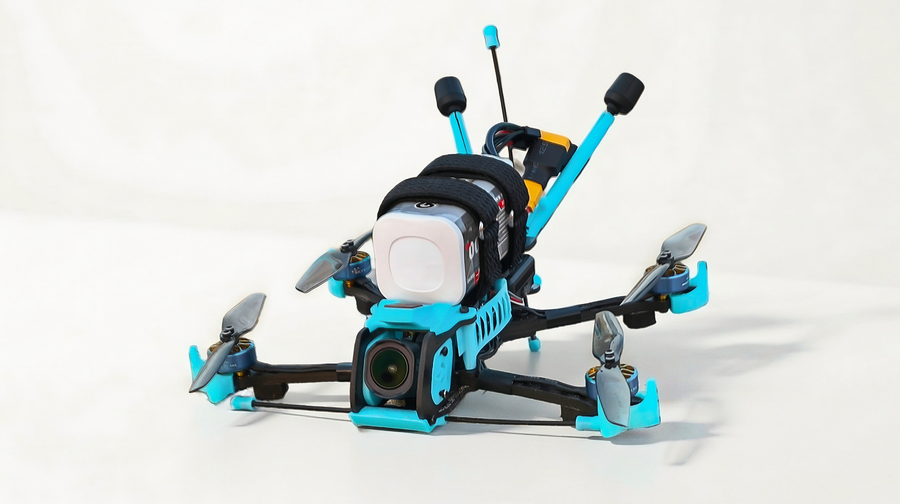

# Memory Halo 4 Long Range Drone Frame

An open source 4 inch long range FPV drone, designed for those that prefer a stronger frame with less vibrations and no jello. This repository includes DXF carbon cutting files for CNC fabrication and STL files for 3D prints aswell as the hardware and documentation needed for one frame. 

## Features

- 4" Propellor size
- Deadcat configuration
- 0-30 Degree camera angle, nothing obstructs the view, but the camera stays 100% protected!
- Plenty of room inside to fit everything (buzzer, capacitor,...)
- Stack mounting: 20x20mm M3 / 25.5x25.5mm M2 / 25.5x25.5mm M2 (angled 45°)
- Vtx mounting: 20x20mm M2 / 25.5x25.5mm M2
- Motor mounting: 9x9mm and 12x12mm
- Camera support: 19/20mm: Analog, Walksnail, DJI O3 Pro, O4, O4 Pro
- Lightweight: ~200g dry with O4 Pro, ~170g analog
- Supports single or double rear standoff design (seperate middle & top plate design for it)

## Hardware needed
Minimum needed to build the frame. Weight can slightly vary, this is just a guideline.

We have used 20mm standoffs of 3.5mm in diameter, and the 23mm length has a diameter of 4mm. For any other size, it is possible the TPU supports will have to be slightly adjusted.

| Qty | Part name | Details | Weight per piece (g) |
|-----|-----------|---------|----------------------|
| 1 | Bottom plate | Carbon fiber plate structure | 5.60 |
| 1 | Middle plate | Carbon fiber plate structure | 8.30 |
| 1 | Top plate | Carbon fiber plate structure | 8.30 |
| 4 | Arms | Carbon fiber motor arms | 4.60 |
| 2 | Camera plates | Carbon fiber camera mounts | 2.10 |
| 5 | M2 20mm standoffs | Spacers for plate separation | 0.35 |
| 1 | M2 23mm standoff | Spacer for camera plates | 0.40 |
| 4 | M2 14mm screws | goes in standoffs | 0.65 |
| 11 | M2 9mm screws | General fasteners | 0.45 |
| 4 | M2 pressnuts | Thread inserts | 0.45 |
| 2 | Battery pad | Sticky battery pad | 4 |
| 1 | 19/20mm camera mount | TPU camera brackets | 2.2 |

### NOTE: for the "Double rear standoff" version, you need the following extra:
| Qty | Part name | Details | Weight per piece (g) |
|-----|-----------|---------|----------------------|
| 1 | M2 20mm standoffs | Spacer for plate separation | 0.35 |
| 2 | M2 9mm screws | General fasteners | 0.45 |

Total minimum frame weight: ~ 65g

## Repository Content

This repository contains everything needed to manufacture and build the frame.

- **[/carbon](carbon/)** 
  DXF files for CNC cutting the carbon fiber plates.  
  Includes both **single rear standoff** and **double rear standoff** frame variants (to avoid confusion, please take a look at the readme there).

- **[/3d-prints](3d-prints/)**  
  STL files for TPU printed components such as camera mounts, gps and antenna mounts.

- **[/battery-pad](battery-pad/)**  
  DXF file for laser cutting the battery pad, comes in 2 variations. 

- **[/betaflight-tune](betaflight-tune/)**  
  Betaflight tune specifically for the frame, to get as clean gyro data as possible. indludes screenshots and the cli txt file

- **[/docs](docs/)** 
  Documentation including:
  - Assembly instructions
  - Hardware requirements
  - [Example build configurations](docs/build-examples.md)

- **[/images](images/)** 
  Photos and diagrams of the frame and example builds.
  Full build examples are available in `/build-examples.md`.

## License

This project is licensed under Creative Commons BY-NC 4.0:

- Personal/hobby builds allowed
- CNC shops may cut frames for personal use
- No mass production or commercial selling
- Do not claim as your design

Full license: https://creativecommons.org/licenses/by-nc/4.0/