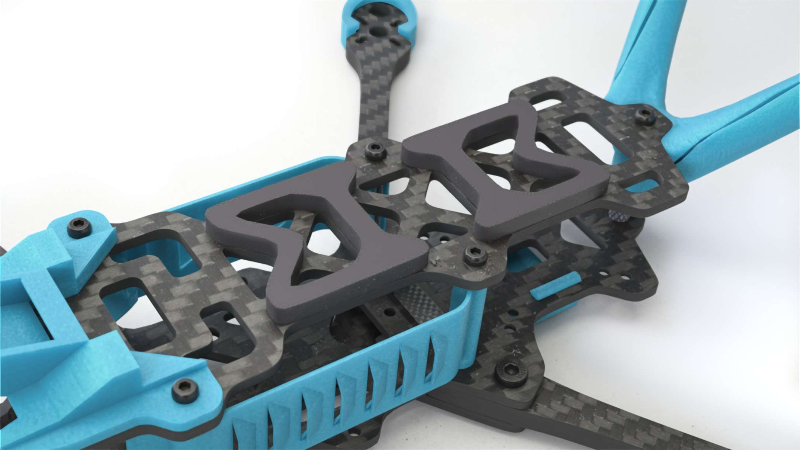
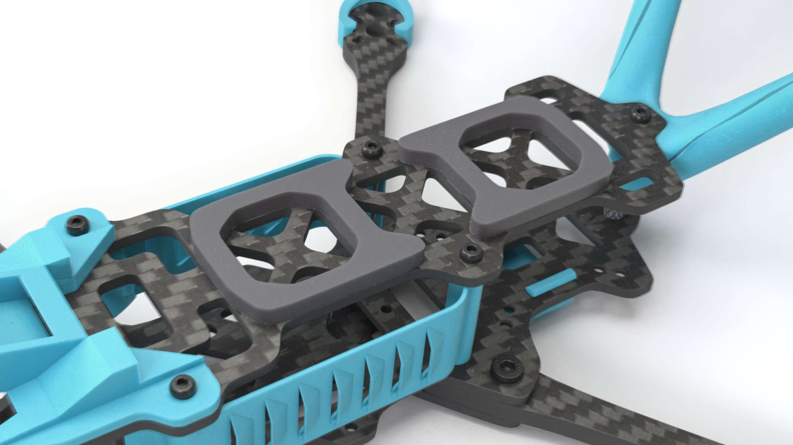

## Battery Pad

**Laser-cut sticky battery pad** mounted on the top plate to improve battery grip and reduce vibration.

### Specifications
| Property | Value |
|----------|-------|
| Quantity | 2 pieces per frame |
| Material | Sticky rubber / foam |
| Thickness | 3mm |

### Variants
Choose one variant and use it for both pieces. Both fit the same top plate:

**Variant 1:**

**Variant 2:**

