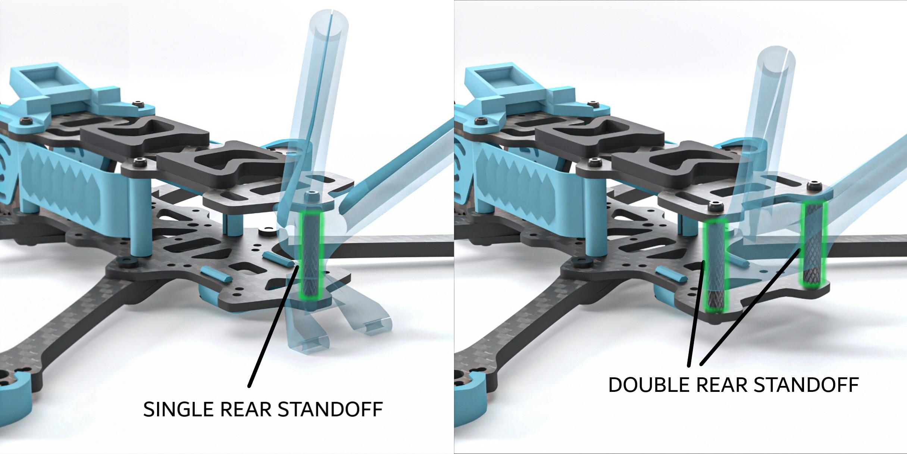

## Carbon Fiber Cutting Files

**Material:** Carbon Fiber (recommended T700)  
**Tolerance:** ±0.05mm ideally

---

## Frame - Shared Parts

| Part | Quantity | Thickness |
|------|-----|-----------|
| memory_halo_arm_4mm.dxf | 4 | 4mm |
| memory_halo_camera_plate_2mm.dxf | 2 | 2mm |
| memory_halo_bottom_plate_2mm.dxf | 1 | 2mm |
| memory_halo_brace_2mm.dxf* | 1 | 2mm |

*Optional, if you really want the extra strength

---

## Frame Variants

The frame has been made with two variants, one with just a single standoff at the rear, and the second with double standoff. The single standoff saves around 4 grams, but sacrifices a bit on durability and how easy it is to mount parts at the rear.

#### One frame consists of all files in the shared parts folder + & top/mid plate from one variant

### Single Rear Standoff vs Double Rear Standoff

### Single Rear Standoff:

| Part | Quantity | Thickness |
|------|-----|-----------|
| memory_halo_mid_plate_single_standoff_2mm.dxf | 1 | 2mm |
| memory_halo_top_plate_single_standoff_2mm.dxf | 1 | 2mm |

### Double Rear Standoff:

| Part | Quantity | Thickness |
|------|-----|-----------|
| memory_halo_mid_plate_double_standoff_2mm.dxf | 1 | 2mm |
| memory_halo_top_plate_double_standoff_2mm.dxf | 1 | 2mm |